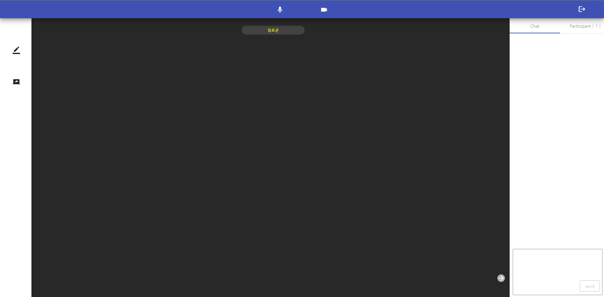
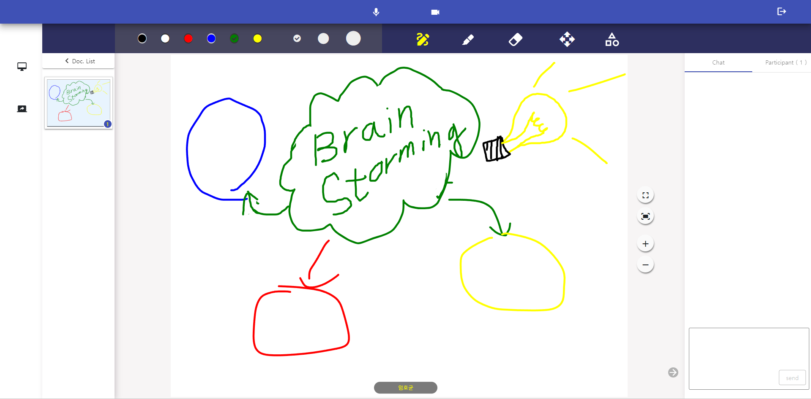

# Potatocs Community Client v0.1.0
> It made by nsmart solution  

## 📖 Contents
- [🔍 Preview](#-preview)
- [🔗 Link](#-Link)
- [📄 Doc](#-doc)
- [🛠️ Features](#%EF%B8%8F-features)
- [📈 Release Note](#-release-note)
- [⚠️ Requirement](#%EF%B8%8F-requirement)
- [⚙️ Installation](#%EF%B8%8F-installation)
    - [Setup](#setup)
    - [Installation](#installation)
- [🪃 Skills](#-skills)
- [🪛 Project Control](#-project-control)
    - [Version Control](#version-control)
    - [Task Control](#task-control)
- [🚀 Deployment](#-deployment)


## 🔍 Preview



<br/>

## 🔗 Link
> https://potatocs.com
<br/>

## 📄 Doc
> https://potatocs.com/docs/
<br/>

## 🛠️ Features
- Real-time video conferencing
    - Through real-time video conferencing, users in different locations can engage in face-to-face meetings, share opinions, and communicate in real-time.
- Real-time document sharing
    - Through real-time document sharing, you can receive and review documents instantly within the context of a real-time meeting.
- Real-time sharing of opinions
    - You can express and document your opinions during meetings through real-time chat.
- Real-time collaborative writing
<br/>

## 📈 Release Note
|version|log|
|---|---|
|0.1.0| Create community versions and upload code |

<br/>

## ⚠️ Requirement
> We recommend using the latest Chrome Browser
<br/>


## ⚙️ Installation
### Setup
- The following pre-tasks are required to run in a local environment  
    - [MongoDB](https://www.mongodb.com/ko-kr/cloud/atlas/lp/try4)
### Installation
```
git clone https://github.com/potatocs-ce/potatocs-ce-meeting-client.git
cd potatocs-ce-meeting-client
npm install
npm start
```
<br/>


## 🪃 Skills


<br/>

## 🪛 Project Control
### Version Control
 


### Task Control
  

<br/>

## 🚀 Deployment


<br/>
<br/>

🙏 Please Check package.json  